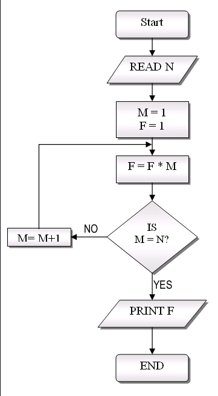
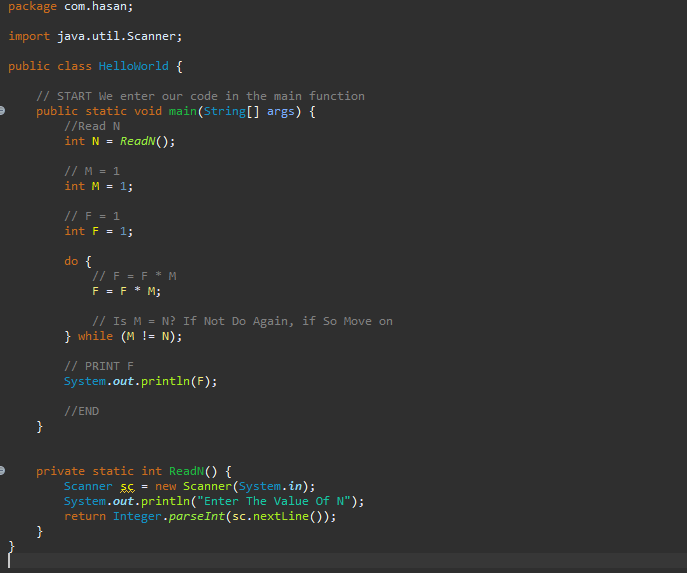

# Logical Operations
In programming, it is important to understand control flow. This is the flow in which our program will execute lines of code. Logical operations play a major
part in dictating that flow. Take a look at the image below.

The above depicts the start of a program, that will proceed to execute lines of code and then make decisions on how to proceed. We can envision this 
control flow diagram in code as such:

